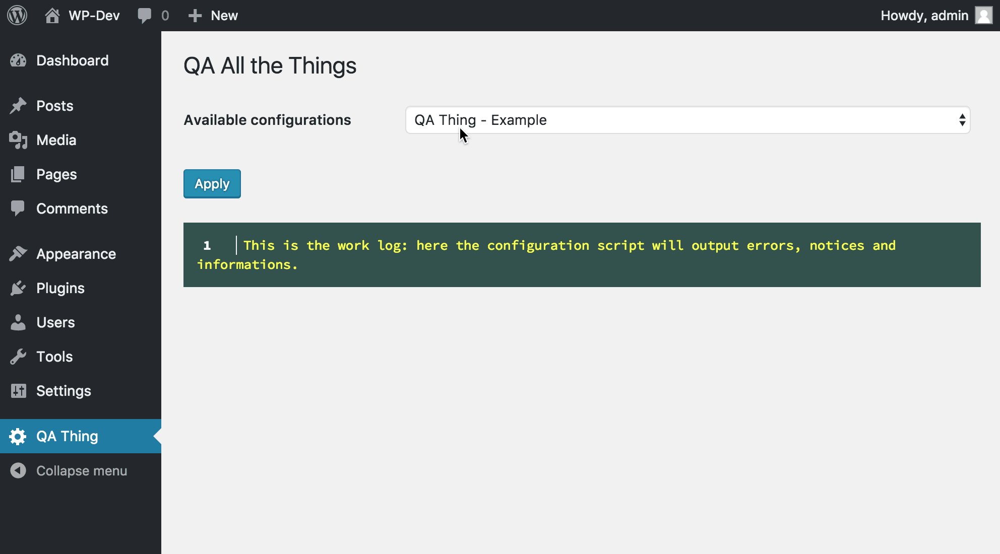

#QA Thing

*WordPress Quality Assurance (QA) setup for the world in developer-friendly way.*



**Still a work in progress: for the time being run `composer update --no-dev` after download to have the plugin work.**

## Installation
Download the plugin [from GitHub](https://github.com/lucatume/function-mocker/archive/master.zip), unzip it in the WordPress plugins folder and activate it from the plugins administration panel.

## Usage

### For QA People
Installed WordPress plugins will define (well: the developers will) QA configuration files and scripts that can be applied using the "QA Thind" options page from the WordPress administration area.
Select a configuration to apply from the available ones and apply it.

### For developers
Create a `qa` folder in the plugin root, and add a `qa-config.json` file in it.
The file should define the configurations that will be available for the plugin in the QA options page; this is the example configuration file contained in this plugin:

```json
{
  "issues": {
    "example": {
      "title": "Example",
      "target": "qa/scripts/example.php"
    },
    "failing-example": {
      "title": "Failing Example",
      "target": "qa/scripts/failing-example.php"
    },
    "fatal-example": {
      "title": "Fatal Error Example",
      "target": "qa/scripts/fatal-error-example.php"
    }
  }
}
```

The format of the file is:

```json
{
  "issues": {
    "issue-id": {
      "title": "Issue human readable title",
      "target": "relative/path/to/script-for-issue.php"
    }
  }
}
```

Ideally configuration and scripts should be left out of any real distribution build and used when delivering to the QA team during development only.

## Configuration scripts
Configuration scripts will be executed when the user (the QA person probably) will apply the configuration pointing to it and will happen in the context of a WordPress installation AJAX call handling.
Scripts can use any code available in WordPress and will be passed a `$messages` variable to print messages to the work log; see the example script code:

```php
<?php
/** @var qa_Utils_Messages $messages */
$messages->information( 'This is an information: welcome to an example configuration script.' );

$var = 0;

$messages->information( 'The script will now add 1 to a variable each second...' );
$messages->notice( 'This is a notice: variable starts at 0' );

for ( $i = 0; $i < 5; $i ++ ) {
	sleep( 1 );
	$var ++;
	$messages->information( 'Variable value is now ' . $var );
}

if ( $var < 6 ) {
	$messages->error( 'This is an error: the variable value is less then 6.' );
}

sleep( 2 );

$messages->success( 'And we are done!' );
```


